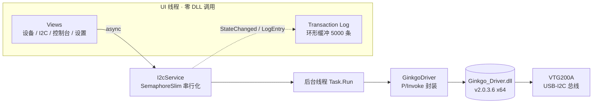

<div align="center">

# ⚡ GinkgoHost

**ViewTool Ginkgo USB-I2C 适配器的现代化上位机**

复刻 [Binho Mission Control](https://support.binho.io/getting-started/binho-mission-control/communication-protocols/i2c/) 交互体验 · WPF Fluent 深色主题 · 纯原生零依赖部署

[]()
[]()
[]()
[]()
[]()


*三段式 I2C 命令面板 · 流式总线扫描 · 实时事务日志*

</div>

---

## 🖼️ 界面预览

| 🔌 设备页 | 🎛️ I2C 命令面板 |
|:-:|:-:|
|  |  |

## ✨ 功能亮点

| | 功能 | 说明 |
|:-:|---|---|
| 🔌 | **连接管理** | 适配器扫描/打开/断开，底部状态栏实时显示通道、速率、最近事务 |
| 🎛️ | **Control Mode** | Hardware I2C（通道 0–1）/ Software I2C（GPIO 0–7 模拟），切换立即生效 |
| ⏱️ | **速率可调** | 100 kHz – 1.2 MHz 预设 + Non-Standard Frequencies 自定义，在线生效 |
| 🔍 | **流式总线扫描** | 0x08–0x77 实时进度、命中地址即时出 chip；当前通道无命中自动扫另一通道 |
| 🔢 | **7/8 位地址体系** | 地址文本与扫描 chip 随格式联动换算，chip 悬停显示两种等价形式 |
| ✍️ | **寄存器/原始读写** | Write Buffer + WRITE、Read Size + READ，Subaddress 留空即原始读写 |
| 📜 | **Transaction Log** | 方向徽章 RX/TX、OK/ERR 胶囊、失败行标红、双击复制、CSV 导出、5000 条环形缓冲 |
| 💻 | **内置控制台** | `scan` / `read` / `write` / `speed` 命令行 + `↑↓` 历史 + 彩色输出 |
| 💾 | **设置持久化** | 通道、模式、速率、地址全部记忆，重启即恢复 |
| 🌓 | **亮/暗主题** | Fluent 主题一键切换 |

## 🚀 快速开始

```bash
git clone https://github.com/Hush-xv/GinkgoHost.git
cd GinkgoHost/GinkgoHost
dotnet build -c Debug
bin\Debug\net8.0-windows\GinkgoHost.exe
```

> [!TIP]
> 仓库已内置 x64 `Ginkgo_Driver.dll` v2.0.3.6，构建自动拷贝到输出目录，开箱即用。
> 只需本机装有 [.NET 8 Desktop Runtime](https://dotnet.microsoft.com/download/dotnet/8.0)（x64）。

## 🎛️ 使用指南

1. **连接**：Settings 里选 Control Mode / Clock Frequency / Channel → 点 **连接适配器**
2. **扫描**：点 Address 输入框或 **SCAN** 按钮 → 命中的地址以 chip 形式弹出，点击选用
3. **读写**：填 Subaddress（寄存器号，留空 = 原始读写）→ WRITE / READ，结果实时进日志
4. **控制台**：切到控制台页直接敲命令，脚本化调试更快

<div align="center">

### 💻 控制台命令

| 命令 | 说明 | 示例 |
|---|---|---|
| `connect` / `disconnect` | 连接/断开适配器 | |
| `speed <kHz>` | 修改速率 | `speed 400` |
| `scan` | 扫描从机 0x08–0x77 | |
| `read <addr7> [reg] <len>` | 寄存器/原始读 | `read 49 00 8` |
| `write <addr7> [reg] <b...>` | 写，最多 16 字节 | `write 49 00 de ad` |

</div>

## 🔬 硬件探针（无 GUI 验证）

`tests/SmokeTest` 内置探针模式，一条命令验证整条总线链路：

```bash
dotnet run --project tests/SmokeTest -c Debug -- --probe 49 00 1 77 1
#                                                     │  │  │ └┬─ 期望值 └┬─ 通道
#                                                     │  │  └── 长度   从机 7 位地址
#                                                     │  └─ 寄存器
```

无参数运行则为无硬件冒烟自检（DLL 加载、入口点、命令解析器）。

> [!IMPORTANT]
> **地址约定**：界面与日志统一使用 **7 位地址**（行业惯例）。
> 数据手册按 8 位标注的地址（如 `0x92`）= 7 位 `0x49`，在 Address Format 切到 8-bit 后可直接填 `92`。
> 驱动层 `Addr` 参数为 8 位格式（7 位 `<< 1`），与官方 AT24C02 例程传 `0xA0` 一致。

## 🏗️ 架构



## 🧭 排障

| 现象 | 处置 |
|---|---|
| 读写全部返回 `EXECUTE_CMD_FAILD (-10)` | 驱动会话卡死——**拔插适配器**复位；并确认从机通道与 Channel 一致 |
| 扫描无命中 | 应用会自动扫另一通道并提示；仍无则查上拉电阻、共地、地址格式（8 位标注需换算） |
| 双击 exe 闪退 | 事件查看器 → Application → `.NET Runtime` 查看堆栈 |
| DLL 加载失败 | 进程位宽须与 `libs/` 下 DLL 一致（当前 x64） |

## ⚠️ 已知限制

- 从机（Slave）模式规划中（驱动 API 已确认：`VII_SlaveReadBytes/WriteBytes` 查询式）
- Internal Pull-Up / Bus Voltage 为 VTG200A 板载跳线控制，无软件接口
- 软件 I2C 速率由 GPIO 时序决定（约 100 kHz 级），不随 Clock Frequency 变化

## 🙏 致谢

- [ViewTool](http://www.viewtool.com/) — Ginkgo 硬件、驱动与 SDK 例程
- [Binho Mission Control](https://binho.io/) — 交互与视觉参考
- [WPF-UI](https://github.com/lepoco/wpfui) — Fluent 控件库

---

<div align="center">

**GinkgoHost** · Made with ⚡ by [Hush-xv](https://github.com/Hush-xv)

⭐ 觉得好用就点个 Star

</div>
