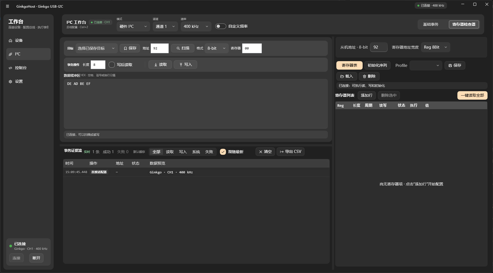
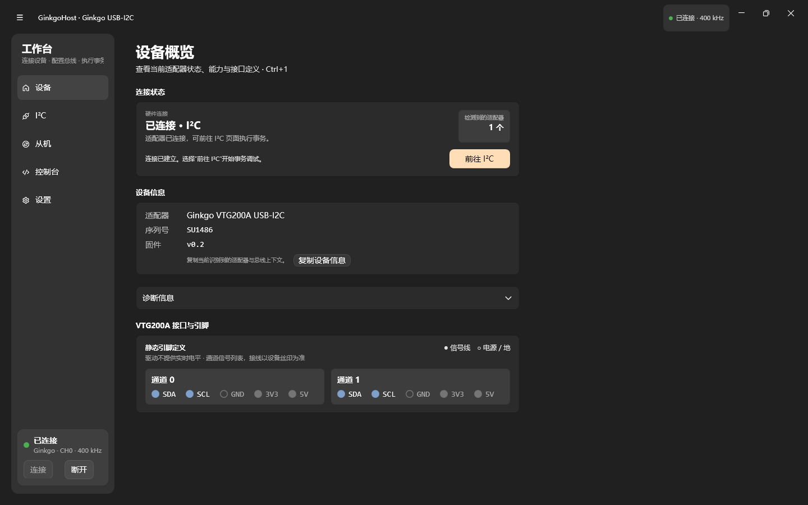

# GinkgoHost

> 面向 ViewTool Ginkgo USB–I²C 适配器的 Windows 调试工具。

GinkgoHost 将连接、读写、地址扫描、周期读取和事务证据流放进一个 WPF 桌面应用。它适合在 bring-up、寄存器验证和现场定位中快速确认一条 I²C 总线的状态。


<p align="center">
  
</p>

## 目录

- [快速开始](#快速开始)
- [首次使用](#首次使用)
- [能力一览](#能力一览)
- [控制台](#控制台)
- [验证与探针](#验证与探针)
- [排障](#排障)
- [项目结构](#项目结构)

## 快速开始

### 前提条件

- Windows 10 或更高版本，x64。
- 安装 [.NET 8 SDK](https://dotnet.microsoft.com/download/dotnet/8.0) 以构建项目；仅运行已构建程序时使用 .NET 8 Desktop Runtime。
- Ginkgo USB–I²C 适配器及其 Windows 驱动。

项目随构建输出 x64 `Ginkgo_Driver.dll`。UI 使用 `WPF-UI`，由 NuGet 还原；它不是“零依赖”程序。运行程序时，`Ginkgo_Driver.dll` 必须与 `GinkgoHost.exe` 位于同一目录。

```powershell
git clone https://github.com/Hush-xv/GinkgoHost.git
cd GinkgoHost
dotnet build .\GinkgoHost\GinkgoHost.csproj -c Debug
.\GinkgoHost\bin\Debug\net8.0-windows\GinkgoHost.exe
```

`dotnet` 未加入环境变量时，使用本机 SDK 的完整路径执行相同命令，例如：

```powershell
& 'C:\Program Files\dotnet\dotnet.exe' build .\GinkgoHost\GinkgoHost.csproj -c Debug
```

发布构建：

```powershell
dotnet build .\GinkgoHost\GinkgoHost.csproj -c Release
```

输出目录为 `GinkgoHost\bin\Release\net8.0-windows\`。

## 首次使用

1. 接好适配器、目标板和共地；确认目标板供电与上拉电阻符合器件要求。
2. 打开 **设置**，选择 I²C 模式、通道、速率和地址显示格式。
3. 在 **设备** 页连接适配器。连接成功后会显示通道、速率、序列号和固件版本。
4. 在 **I²C** 页填写目标地址，先执行 **SCAN** 或一次小长度 **READ**。
5. 确认日志中的地址、结果和数据正确后，再执行会改变器件状态的写操作。

> [!WARNING]
> `WRITE`、初始化序列和周期写会改变目标器件状态。对 EEPROM、Flash、配置寄存器和执行机构，请先核对地址、子地址、数据和电源状态。不要把扫描、读取成功当作写入安全的证明。

### 地址规则

界面可显示 7-bit 或 8-bit 地址；驱动调用始终转换为 7-bit 地址。

| 数据手册写法 | 7-bit 显示 | 8-bit 显示 |
|---|---:|---:|
| `0x92`（写地址） | `0x49` | `0x92` |

8-bit 地址必须是偶数写地址。若数据手册仅给出读地址，请先换算到对应写地址再输入。

## 能力一览

| 区域 | 能力 |
|---|---|
| 设备 | 扫描、连接、断开；显示适配器序列号、固件和驱动信息；离线刷新不会保留旧设备身份。 |
| I²C 工作区 | Hardware I²C（通道 0–1）与 Software I²C（GPIO 0–7）；100 kHz、400 kHz、1 MHz、1.2 MHz 和自定义硬件速率。 |
| 地址与读写 | 7/8-bit 地址显示；寄存器读写与原始读写；输入阶段校验地址、长度和子地址。 |
| 总线扫描 | 扫描 `0x08`–`0x77`，实时进度条与命中地址即时入列；未命中时可检查另一硬件通道；扫描中可随时中止。 |
| 事务日志 | RX / TX / SYS 分类、失败提示、筛选与排序、复制单条记录、CSV 导出、5,000 条环形缓冲。 |
| 控制台 | 快捷命令、历史导航、彩色输出、周期读和停止控制；输出保留最近 1,000 行，命令历史保留最近 200 条。 |
| 扩展工作区 | 寄存器表批量读取、初始化序列、Profile 保存与载入，以及 8/16-bit 子地址支持。 |
| 使用体验 | 亮/暗主题、响应式布局、自动连接选项、应用重启后恢复常用 I²C 设置。 |

<p align="center">
  
</p>

## 控制台

控制台适合重复执行小型调试动作。地址按当前地址格式输入；示例使用 7-bit 地址 `49`。

| 命令 | 作用 | 示例 |
|---|---|---|
| `help` | 显示命令列表 | `help` |
| `connect` / `disconnect` | 连接或断开适配器 | `connect` |
| `adapters` | 刷新并显示适配器数量 | `adapters` |
| `status` / `config` | 显示会话状态或当前配置 | `status` |
| `speed <kHz>` | 切换硬件 I²C 速率 | `speed 400` |
| `scan` | 扫描从机地址 | `scan` |
| `read <addr> [reg] <len>` | 执行寄存器或原始读取 | `read 49 00 8` |
| `write <addr> [reg] <b...>` | 写入数据 | `write 49 00 de ad` |
| `readloop <addr> [reg] <len> <ms>` | 启动周期读 | `readloop 49 00 8 500` |
| `stop` | 停止周期读 | `stop` |
| `clear` | 清空控制台输出 | `clear` |

`↑`、`↓` 可浏览命令历史；周期读运行时按 `Esc` 或输入 `stop` 停止。

## 验证与探针

测试工程位于 `GinkgoHost\tests\SmokeTest`。从仓库根目录运行：

```powershell
# 纯数据展示与日志容量检查，不访问硬件
dotnet run --project .\GinkgoHost\tests\SmokeTest\SmokeTest.csproj -c Debug -- --log-display

# 日志异步落盘检查：写入端不阻塞、Flush 后完整落盘且顺序一致
dotnet run --project .\GinkgoHost\tests\SmokeTest\SmokeTest.csproj -c Debug -- --log-async

# 事务计数检查：增量维护的成功/失败、方向与连续失败统计与全表重算逐条对比
dotnet run --project .\GinkgoHost\tests\SmokeTest\SmokeTest.csproj -c Debug -- --log-counters

# 基础冒烟检查。连接 Ginkgo 后会额外打开、初始化并只读扫描总线。
dotnet run --project .\GinkgoHost\tests\SmokeTest\SmokeTest.csproj -c Debug

# 只读读取适配器身份信息
dotnet run --project .\GinkgoHost\tests\SmokeTest\SmokeTest.csproj -c Debug -- --boardinfo

# 对已知从机执行一次读取：地址、寄存器、长度、期望首字节、通道
dotnet run --project .\GinkgoHost\tests\SmokeTest\SmokeTest.csproj -c Debug -- --probe 49 00 1 77 0

# Total Phase Aardvark 链路验证：枚举、打开、只读扫描、关闭
dotnet run --project .\GinkgoHost\tests\SmokeTest\SmokeTest.csproj -c Debug -- --aardvark 400
```

`--probe` 会访问目标从机，但不会写入。使用前请将示例参数替换为实际硬件参数。

`--aardvark` 只验证 `aardvark.dll` 的加载与调用链路。**当前界面不支持 Aardvark**：所有事务都走 Ginkgo USB-I²C，
`Native/AardvarkI2c.cs` 与该原生 DLL 随构建分发，仅作为后续扩展的既有铺垫，不构成受支持的设备路径。

## 排障

| 现象 | 检查顺序 |
|---|---|
| 未检测到适配器 | 检查 USB 连接、Windows 驱动、设备管理器；在控制台执行 `adapters` 后重新连接。 |
| `EXECUTE_CMD_FAILD (-10)` | 断开并重新连接；仍失败时拔插适配器。再检查目标板供电、共地、通道和模式。 |
| 扫描无命中 | 检查上拉电阻、SCL/SDA 接线、目标地址和地址格式；Hardware I²C 时确认通道 0 或 1。 |
| 地址正确但读取异常 | 缩低速率；确认寄存器地址宽度、重复起始条件和器件时序要求。 |
| 程序无法启动或 DLL 加载失败 | 确认使用 x64 系统与 x64 构建输出；不要单独移动 `GinkgoHost.exe`，需同时保留同目录的原生 DLL。 |
| 周期读自动停止 | 查看事务日志中的连续失败项；恢复总线后重新启动周期读。 |

日志文件与设置文件的路径可在 **设置** 页复制。发生未处理异常时，优先保留最新日志、目标接线信息和复现步骤。

日志由后台线程批量写入，弹窗报错与退出前会先落盘，因此崩溃现场的末尾记录不会丢。文件以共享方式打开，
程序运行中即可用编辑器或 `Get-Content -Wait` 实时跟踪。

## 项目结构

```text
GinkgoHost/
├─ GinkgoHost/                 WPF 应用
│  ├─ Views/                   设备、I²C、控制台与设置页面
│  ├─ Services/                I²C 会话、命令解析与设置持久化
│  ├─ Native/                  Ginkgo DLL P/Invoke 封装
│  ├─ Models/                  事务日志与数据模型
│  ├─ libs/x64/                随程序分发的原生 DLL
│  └─ tests/SmokeTest/         无 GUI 验证与硬件探针
└─ docs/images/                README 截图
```

## 已知边界

- 当前应用面向 USB–I²C 主机调试；从机模式不在此版本范围内。
- 板载上拉与总线电压由硬件跳线决定，应用不控制这些电气配置。
- Software I²C 的速率由 GPIO 时序决定，不随 Hardware I²C 的速率设置变化。

## 致谢

- [ViewTool](http://www.viewtool.com/)：Ginkgo 硬件、驱动与 SDK 例程。
- [Binho Mission Control](https://binho.io/)：交互参考。
- [WPF-UI](https://github.com/lepoco/wpfui)：Fluent 控件库。
